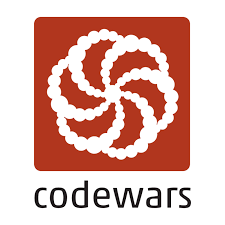

 <h1 align="center">Codewars Challenges</h1> 

  

Este repositório contém uma coleção de desafios de lógica de programação do site Codewars. Os desafios estão disponíveis nas linguagens Java, JavaScript, TypeScript e Python.

## Sobre o Codewars
O [Codewars](https://www.codewars.com) é uma plataforma online que oferece uma ampla variedade de desafios de programação. Os desafios são classificados por níveis de dificuldade e abrangem diversos conceitos de programação e algoritmos. Resolver esses desafios pode ajudá-lo a aprimorar suas habilidades de resolução de problemas, aprender novas técnicas de programação e melhorar seu domínio geral das linguagens de programação.

## Meu Perfil no Codewars
Meu perfil no Codewars é [Taz.M](https://www.codewars.com/users/Taz.M). Lá, você pode acompanhar meu progresso na resolução dos desafios e verificar minha classificação.

## Contribuição
Você é bem-vindo para contribuir com novos desafios ou melhorias nos desafios existentes. Se você tiver algum desafio interessante para compartilhar, sinta-se à vontade para enviar uma solicitação de pull. Vamos crescer juntos!

## Contato
Se você tiver alguma dúvida ou sugestão, não hesite em entrar em contato. Você pode me encontrar em:

  |  |  |  |
  |---|---|---|

  

 

  <a align="right" href="#top">Voltar ao topo</a>

